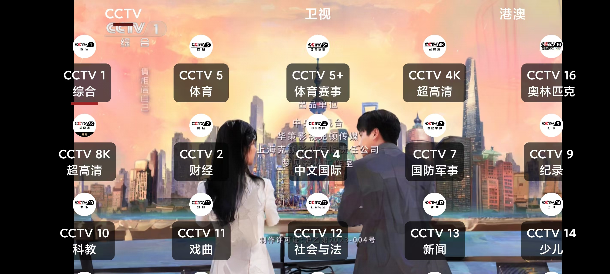

# 我们的电视

电视直播软件，安装即可使用，高清，超清，蓝光，完全免费，您再也不用费劲巴力的找各种不稳定的直播源了。


# 下载

https://github.com/andandroidor/ourtv/releases/

**xxxx_androidtv.apk 电视版**

**xxxx_androidphone.apk 安卓手机版**

与央视频不兼容，建议关闭各应用市场的自动更新。可能会被央视频覆盖安装。

# 安装

-   U盘安装
-   电视如果启用开发者调试模式，可以通过ADB命令进行安装：

```
   adb  install  -r  -f   xxx.apk
```


请勿安装错误版本

手机版安装之后长这样：


电视版安装之后长这样：




# Thanks

@my-tv https://github.com/lizongying/my-tv

@央视频 

@凤凰新闻


# 声明

本项目仅供学习研究，禁止用于商业用途，请于下载二十四小时内删除。

本项目可能随时终止，请大家谨慎使用，建议使用官方渠道进行观看。

本项目使用的部分代码、图片、文字等资源来源于网络，如有侵权，请联系删除。

# 安全

回应一些xx的污蔑，觉得没有源码就不安全。特此声明，本软件绝对安全，详见以下全球47家安全厂商的测试报告。

手机版：
https://www.virscan.org/report/fd6885d656fed7d63c4db84647855330dd7e994bc04750e3edcd82aae7cc7d1f


TV版：
https://www.virscan.org/report/f0f91694225f5aff243f0bf91f3b464bf5de54222b0d63e10e58844afbf3f18b


后续版本请自行上传扫描

# 联系

电报群： https://t.me/+z1BOPITtAmI4ZWZl  新版本将在该群第一时间放出。


# 支持

### 感谢您的支持 😘😘😘

大龄被裁程序员在线乞讨，感谢各位老板赏口饭吃🤕


### 感谢您的Star 😘😘😘

[](https://star-history.com/#andandroidor/ourtv&Date)
