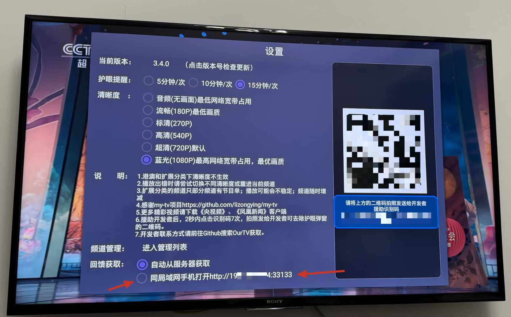
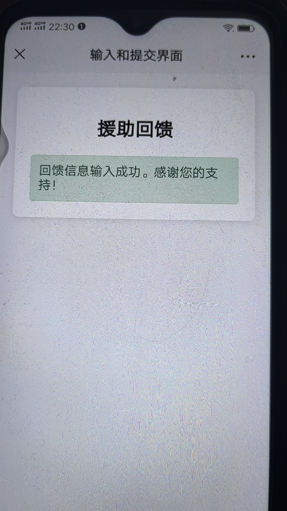

# 我们的电视

电视直播软件，安装即可使用，高清，超清，蓝光，完全免费，您再也不用费劲巴力的找各种不稳定的直播源了。
更有节目单回看强大功能秒杀市面上各类XXXPTV

# 下载

https://github.com/andandroidor/ourtv/releases/

**xxxx_androidtv.apk 电视版**

**xxxx_androidphone.apk 安卓手机版**

请勿安装错误版本

与央视频不兼容，建议关闭各应用市场的自动更新。可能会被央视频覆盖安装。

如需将OurTV和央视频两个app都安装在同一个手机里，请尝试使用Android虚拟机程序，推荐使用VMOS，在虚拟的手机环境里安装另一个app即可。

# 安装

-   U盘安装
-   电视如果启用开发者调试模式，可以通过ADB命令进行安装：

```
   adb  install  -r  -f   xxx.apk
```

# 大致操作

### 手机端

*用于交个朋友，<u>无任何限制</u>（最后版本3.2.7，之后不再维护）*

### 电视端

##### 正常观看：

1. 上下左右键唤出选台菜单，菜单10秒后自动消失，或返回键消失
2. 选择过滤器全部 CCTV 卫视 港澳 扩展（不稳定源收录在扩展里，仅部分频道有节目单）
3. 选择频道
4. 菜单键唤出设置页面，切换清晰度

##### 回看节目：

1. 进入回看：各频道的节目单(EPG)有回看能力的，会有`回看`字样标识
2. 回看过程：屏幕右上角会固定`正在回看`标识，左键快退，右键快进，上下键唤出选台菜单
3. 退出回看：进入回看后，上下键唤出选台菜单，移动光标选中`正在回看`点击OK后，返回该频道最新的直播画面，或两次点击返回键，或另外选其他频道即可退出当前的回看节目，或快进到最新直播画面


# 援助回馈


>
> 注：<u>无论援助与否，均不影响您正常观看电视直播</u>。
>


### 一、累计援助开发者超过39元（仅累计1次），可**永久**开启：


部分频道的回看功能，可回看当天节目（支持回看的节目会有`回看`标记，央视和大部分卫视的节目支持回看，港澳和扩展不支持回看）


### 二、累计援助开发者超过99元，可**1年内**享有 ：


① 回看过去6天内的节目

② 开启遥控器上下键（或频道+-键）换台 

③ 禁用护眼提醒的弹窗

④ 移除app中所有二维码

⑤ 屏蔽开机公告

⑥ 屏蔽指定频道

⑦ 可添加5个援助码（或5台设备，以首个援助识别码或设备录入开始3个月内添加完毕，过期失效）。


### 三、补充说明

未到期不可用按剩余时间折算退援助款，正常使用到期后援助累计金额归零；

仅累计1次是说，您援助39元后，可再只加60元即可按照第二条规则回馈，之后的回馈到期后不再算入这39元；

<u>无论援助与否，均不影响您正常观看电视直播</u>；

感谢您的支持和信任。


### 四、回馈生效


网络连通情况下，援助后，联系开发者，发送`援助识别码`和`援助记录`，OurTV会自动拉取回馈数据，并自动生效：

`设置页有“回看功能已对该设备开放”字样，说明回看功能已开启，证明已生效`，

或，

`设置页面赞赏码消失，证明已生效`。


但，网络无法连通时，请打开手动输入服务使回馈生效，步骤如下：

① 打开设置页面，"回馈获取"，启动手动输入服务：



② 使用和电视同一局域网同网段下（一般家庭同一路由器下，若路由器不可用，可开启手机热点wifi，不用开流量，电视连手机热点）的手机，用手机浏览器扫码打开提示网址：


③联系开发者获取回馈代码


④在手机中粘贴并提交，提示成功即生效：




# 联系

电报群： https://t.me/+z1BOPITtAmI4ZWZl   新版本将在该群第一时间放出。 

<span>
&nbsp;&nbsp;&nbsp;&nbsp;</span>


优先电报联系，仅有电报群，无微信群、QQ群、公众号、抖音号等，请勿上当受骗；

因微信被封经历，加好友后请查看朋友圈置顶消息，不再主动发起聊天，感谢理解。

# 大感谢

@感谢lizongying大佬的my-tv https://github.com/lizongying/my-tv

@感谢各位大佬维护的各类直播源 https://m3u.ibert.me/

@央视频 

@凤凰新闻


# 声明

本项目仅供学习研究，禁止用于商业用途。

本项目可能随时终止，请大家谨慎使用，建议使用官方渠道进行观看。

本项目使用的部分代码、图片、文字等资源来源于网络，如有侵权，请联系删除。

本项目下载、安装、观看电视、过程中无任何限制，完全免费，谨防上当受骗。

本项目仅服务于中国大陆及香港、澳门地区，其他区域请结合自身需求下载使用。

# 安全

回应一些xx的污蔑，觉得没有源码就不安全。特此声明，本软件绝对安全，详见images文件夹下的全球47家安全厂商的测试报告。

后续版本请自行上传扫描 https://www.virscan.org

# 支持

### 感谢您的支持 😘😘😘

2024.8.1第一次收到网友的红包，很高兴，高兴的不是红包多少，而是感觉自己给别人多多少少带去了些许价值，做的事情多少对他人有点用处。

大龄被裁程序员在线乞讨，感谢各位看官老爷赏口饭吃，手头阔绰的兄弟可以打赏点，没有也没关系，也丝毫不影响我们加好友，成为朋友!


### 感谢您的Star 😘😘😘


### 常见问题

常见问题见电报群“常见问题”话题，此处不再一一列出

# 问题用户

1. 昵称为“快乐爷爷”的用户您发送的援助识别码只有30位少了6位，请微信联系微信号 Our_TV 补充。
2. 昵称为“👑  ヅ忝のぺ驕耔 ✨”的用户您发送的好友申请，我加不上您，请检查您自己的微信人员列表是否已满。
