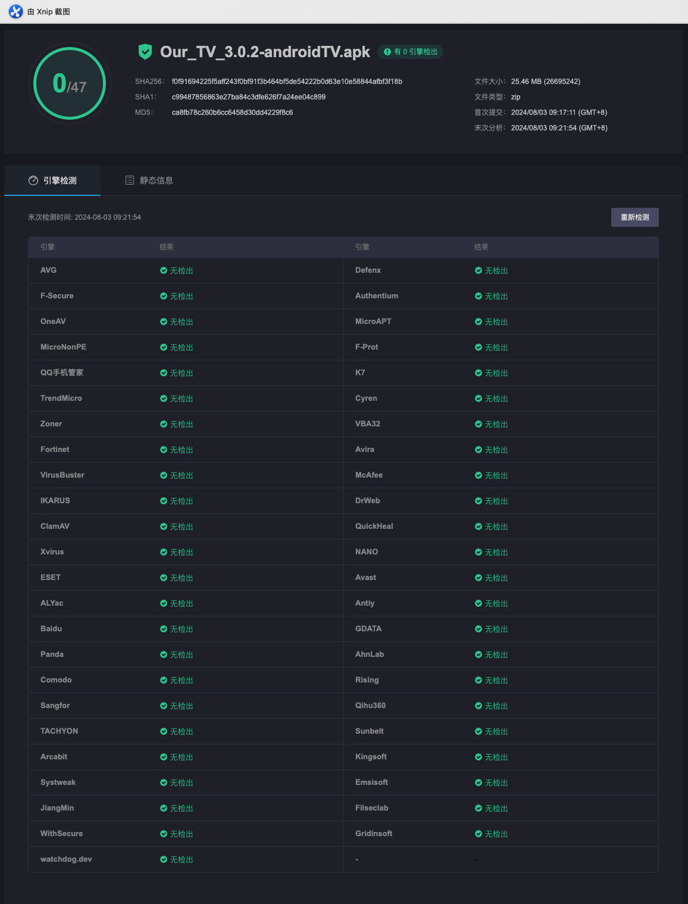

# 我们的电视

电视直播软件，安装即可使用


# 下载

https://github.com/andandroidor/ourtv/releases/

xxxx_tv.apk 电视版

xxxx_android.apk 安卓手机版

与央视频不兼容，建议关闭各应用市场的自动更新。可能会被央视频覆盖安装。

# 安装

-   U盘安装
-   电视如果启用开发者调试模式，可以通过ADB命令进行安装：

```
   adb  install  -r  -f   xxx.apk
```

# Thanks

@my-tv https://github.com/lizongying/my-tv

@央视频 

@凤凰新闻


# 声明

本项目仅供学习研究，禁止用于商业用途，请于下载二十四小时内删除。

本项目可能随时终止，请大家谨慎使用，建议使用官方渠道进行观看。

本项目使用的部分代码、图片、文字等资源来源于网络，如有侵权，请联系删除。

# 安全

回应一些傻逼的污蔑，觉得没有源码(恕我直言你有源码也编译不过)就不安全，特此声明，本软件绝对安全。

手机版：
https://www.virscan.org/report/fd6885d656fed7d63c4db84647855330dd7e994bc04750e3edcd82aae7cc7d1f


TV版：
https://www.virscan.org/report/f0f91694225f5aff243f0bf91f3b464bf5de54222b0d63e10e58844afbf3f18b



# 支持

### To有钱的大哥大姐，感谢您捧个钱场

感谢您的支持,😘😘😘


### To暂时拮据的大哥大姐，感谢您的Star

感谢您的支持,😘😘😘

[](https://star-history.com/#andandroidor/ourtv&Date)